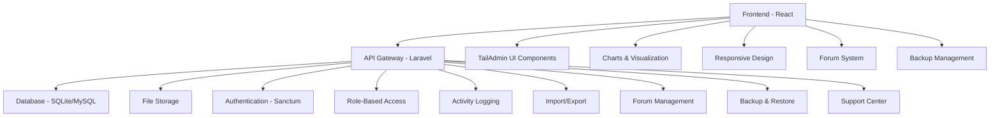
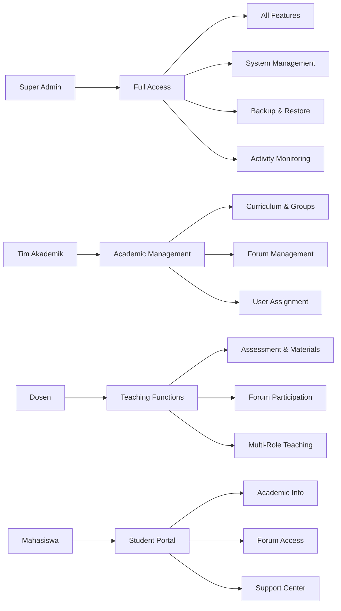

<div align="center">
  <h1 align="center">🎓 ISME</h1>
  <p align="center">
    <strong>Integrated Student Management & Education System for Universitas Muhammadiyah Jakarta</strong>
  </p>
  
  
  
  <br/><br/>
  
  <div align="center">
    <a href="https://laravel.com">
      
    </a>
    <a href="https://reactjs.org">
      
    </a>
    <a href="https://www.typescriptlang.org">
      
    </a>
    <a href="https://tailwindcss.com">
      
    </a>
    <a href="https://tailadmin.com">
      
    </a>
  </div>
  
  <br/>
  
  <div align="center">
    <a href="https://github.com/arkannaufl/isme-fkk/issues">
      
    </a>
    <a href="https://github.com/arkannaufl/isme-fkk/stargazers">
      
    </a>
    <a href="https://github.com/arkannaufl/isme-fkk/network/members">
      
    </a>
    <a href="LICENSE">
      
    </a>
  </div>
</div>

## 📋 Deskripsi

> **ISME (Integrated Student Management & Education)** adalah aplikasi web komprehensif yang dirancang untuk mengelola seluruh aspek akademik di Universitas Muhammadiyah Jakarta. Sistem ini mendukung manajemen kurikulum berbasis blok, Problem Based Learning (PBL), Case Study Review (CSR), penjadwalan akademik, absensi, penilaian, dan pelaporan yang terintegrasi.

### 🎯 **Key Highlights**
- 🏫 **University-Grade**: Built specifically for Universitas Muhammadiyah Jakarta
- 🎨 **Modern UI**: Based on [TailAdmin React](https://tailadmin.com/) professional dashboard template
- 🔐 **Multi-Role System**: 4 distinct user roles with granular permissions
- 📊 **Real-time Analytics**: Comprehensive dashboard with live data visualization
- 📱 **Responsive Design**: Optimized for desktop, tablet, and mobile devices
- 🔄 **Import/Export**: Bulk data management with Excel integration
- 💬 **Forum System**: Integrated discussion forum with categories and access control
- 💾 **Smart Backup**: Automated backup system with auto-correction and restore
- 📈 **Activity Tracking**: Comprehensive activity logging with advanced filtering
- 🛠️ **Support Center**: Built-in support system with developer information

## ✨ Fitur Utama

### 🎯 Manajemen Akademik
- **Kurikulum Berbasis Blok**: Pengelolaan mata kuliah dengan sistem blok semester
- **PBL (Problem Based Learning)**: Manajemen modul PBL dengan penugasan dosen dan kelompok
- **CSR (Case Study Review)**: Sistem review kasus dengan penjadwalan dan penilaian
- **Penjadwalan Terintegrasi**: Kuliah besar, praktikum, jurnal reading, dan agenda khusus
- **Manajemen Kelompok**: Kelompok besar dan kecil dengan sistem semester reguler dan antara
- **Mata Kuliah Keahlian**: Pengelolaan kompetensi dan keahlian dosen per mata kuliah
- **Dosen Peran Multi**: Sistem peran dosen yang dapat mengajar multiple mata kuliah

### 👥 Manajemen Pengguna
- **Multi-Role System**: 4 level akses (Super Admin, Tim Akademik, Dosen, Mahasiswa)
- **Role-Based Access Control**: Setiap role memiliki akses dan fitur yang berbeda
- **Import Data Massal**: Import dosen, mahasiswa, tim akademik, dan ruangan via Excel
- **Manajemen Profil**: Update profil, avatar, dan informasi personal
- **Hybrid Import System**: Import mahasiswa dengan validasi dan error handling canggih

### 📊 Monitoring & Analytics
- **Dashboard Real-time**: Statistik akademik, kehadiran, dan penilaian
- **Sistem Absensi**: Tracking kehadiran untuk PBL, CSR, dan jurnal reading
- **Penilaian Terintegrasi**: Sistem penilaian PBL dan jurnal dengan export laporan
- **Pelaporan Komprehensif**: Export data dalam format Excel dan PDF
- **Activity History**: Pencatatan lengkap aktivitas sistem dengan filter dan pencarian
- **System Health Monitoring**: Monitoring kesehatan sistem dan performa database

### 🔧 Fitur Teknis
- **File Management**: Upload dan download RPS, materi kuliah, dan dokumen
- **Notification System**: Notifikasi real-time untuk penugasan dan jadwal
- **Activity Logging**: Pencatatan aktivitas pengguna dengan Spatie Activity Log
- **Backup & Restore**: Sistem backup otomatis dan restore data dengan auto-correction
- **Responsive Design**: Interface yang optimal di desktop dan mobile
- **Forum Diskusi**: Sistem forum dengan kategori, like, bookmark, dan access control
- **Support Center**: Pusat bantuan dengan informasi developer dan kontak

### 🗂️ Sistem Forum & Komunikasi
- **Forum Kategori**: Pengelolaan kategori forum dengan icon dan warna custom
- **Access Control**: Forum publik dan privat dengan kontrol akses granular
- **Like & Bookmark**: Sistem like dan bookmark untuk forum dan reply
- **Real-time Updates**: Update waktu real-time dan notifikasi
- **Search & Filter**: Pencarian dan filter forum berdasarkan kategori dan status
- **Anonymous Posting**: Opsi posting anonim untuk forum tertentu

### 💾 Backup & Data Management
- **Automated Backup**: Backup otomatis database dengan multiple format (SQL, ZIP)
- **Smart Import**: Import backup dengan auto-detection dan correction
- **Data Validation**: Validasi data import dengan error reporting detail
- **Pre-import Backup**: Backup otomatis sebelum import untuk keamanan data
- **File Management**: Pengelolaan file backup dengan download dan delete

## 🛠️ Tech Stack

### Backend
- **Framework**: Laravel 12.x
- **PHP**: 8.2+
- **Database**: SQLite (default), MySQL, PostgreSQL
- **Authentication**: Laravel Sanctum
- **Key Packages**:
  - Spatie Laravel Permission (Role & Permission)
  - Spatie Laravel Activity Log (Activity Tracking)
  - Maatwebsite Excel (Import/Export)
  - Jenssegers Agent (Device Detection)
  - Carbon (Date/Time Management)
  - ZipArchive (Backup Management)

### Frontend
- **Framework**: React 18.x dengan TypeScript
- **UI Template**: [TailAdmin React](https://tailadmin.com/) - Professional Admin Dashboard
- **Styling**: TailwindCSS 4.x, Material-UI
- **UI Components**: Headless UI, React Icons
- **Charts & Visualization**: ApexCharts, Recharts
- **Calendar**: FullCalendar
- **File Handling**: ExcelJS, jsPDF, html2canvas
- **Build Tool**: Vite

### Development Tools
- **Package Manager**: Composer (PHP), npm (Node.js)
- **Code Quality**: ESLint, Laravel Pint
- **Testing**: PHPUnit
- **Version Control**: Git

## 🚀 Quick Start

### 📋 Prerequisites

| Requirement | Version | Description |
|-------------|---------|-------------|
| **PHP** | 8.2+ | Backend runtime environment |
| **Composer** | Latest | PHP dependency manager |
| **Node.js** | 18+ | Frontend runtime environment |
| **npm** | Latest | Node package manager |
| **Database** | Any | SQLite (default), MySQL, or PostgreSQL |

### ⚡ One-Click Setup

```bash
# 1. Clone repository
git clone https://github.com/arkannaufl/isme-fkk.git
cd isme-fkk

# 2. Setup Backend (Laravel)
cd backend
composer install
cp .env.example .env
php artisan key:generate
php artisan migrate --seed
php artisan storage:link
php artisan serve &

# 3. Setup Frontend (React)
cd ../frontend
npm install
npm run dev

# 4. Optional: Create initial backup
cd ../backend
php artisan backup:create
```

### 🔧 Manual Setup

<details>
<summary><strong>📦 Backend Setup (Laravel)</strong></summary>

```bash
# Masuk ke direktori backend
cd backend

# Install dependencies
composer install

# Copy environment file
cp .env.example .env

# Generate application key
php artisan key:generate

# Konfigurasi database di .env
# DB_CONNECTION=sqlite (default)
# atau
# DB_CONNECTION=mysql
# DB_HOST=127.0.0.1
# DB_PORT=3306
# DB_DATABASE=your_database_name
# DB_USERNAME=your_username
# DB_PASSWORD=your_password

# Jalankan migrasi dan seeder
php artisan migrate --seed

# Buat symbolic link untuk storage
php artisan storage:link

# Jalankan server Laravel
php artisan serve

# Optional: Create initial backup
php artisan backup:create
```

</details>

<details>
<summary><strong>⚛️ Frontend Setup (React)</strong></summary>

```bash
# Masuk ke direktori frontend
cd frontend

# Install dependencies
npm install

# Setup environment (Development)
npm run setup:dev

# Jalankan development server
npm run dev

# Atau untuk production
npm run setup:prod
npm run build:prod

# Optional: Test forum functionality
npm run dev
```

</details>

### 🌐 Access Application

| Service | URL | Description |
|---------|-----|-------------|
| **Frontend** | http://localhost:5173 | React application (dev) |
| **Backend API** | http://localhost:8000 | Laravel API (dev) |
| **API Docs** | http://localhost:8000/api | API documentation (dev) |
| **Production** | https://isme.fkkumj.ac.id | Live application |

### 🔗 Key API Endpoints

| Endpoint | Method | Description | Access |
|----------|--------|-------------|---------|
| `/api/auth/*` | POST/GET | Authentication & user management | Public/Protected |
| `/api/forums/*` | GET/POST/PUT/DELETE | Forum management | Protected |
| `/api/system/backup` | POST | Create system backup | Super Admin |
| `/api/system/import` | POST | Import backup | Super Admin |
| `/api/reporting/*` | GET | Activity logs & reports | Super Admin |
| `/api/users/import` | POST | Bulk user import | Super Admin |
| `/api/mata-kuliah/import` | POST | Course data import | Tim Akademik |

### 🔑 Default Credentials

| Role | Username | Password |
|------|----------|----------|
| **Super Admin** | `admin` | `password` |
| **Tim Akademik** | `tim_akademik` | `password` |
| **Dosen** | `dosen` | `password` |
| **Mahasiswa** | `mahasiswa` | `password` |

## 📁 Project Structure

```
isme-fkk/
├── 📁 backend/                    # Laravel API Backend
│   ├── 📁 app/
│   │   ├── 📁 Http/Controllers/   # API Controllers (41 files)
│   │   ├── 📁 Models/            # Eloquent Models (30+ files)
│   │   ├── 📁 Imports/           # Excel Import Classes (6 files)
│   │   ├── 📁 Services/          # Business Logic Services
│   │   └── 📁 Notifications/     # Email Notifications
│   ├── 📁 database/
│   │   ├── 📁 migrations/        # Database Migrations (52 files)
│   │   └── 📁 seeders/          # Database Seeders (11 files)
│   ├── 📁 routes/
│   │   └── 📄 api.php           # API Routes
│   └── 📁 config/               # Configuration Files
├── 📁 frontend/                   # React Frontend (TailAdmin-based)
│   ├── 📁 src/
│   │   ├── 📁 components/        # Reusable Components (28 files)
│   │   ├── 📁 pages/            # Page Components (44 files)
│   │   ├── 📁 context/          # React Context (3 files)
│   │   ├── 📁 hooks/            # Custom Hooks
│   │   ├── 📁 icons/            # SVG Icons (59 files)
│   │   ├── 📁 layout/           # Layout Components (4 files)
│   │   ├── 📁 services/         # API Services
│   │   └── 📁 utils/            # Utility Functions (3 files)
│   └── 📁 public/               # Static Assets
└── 📄 README.md
```

### 🏗️ Architecture Overview



## 👥 User Roles & Permissions

| Role | Description | Key Features |
|------|-------------|--------------|
| **🔧 Super Admin** | System administrator with full access | • Manage academic years & semesters<br>• User management (all roles)<br>• System configuration & backup<br>• Access to all features & reports<br>• Forum management & moderation<br>• System health monitoring<br>• Activity log access |
| **📚 Tim Akademik** | Academic team with curriculum management | • Course & curriculum management<br>• PBL & CSR instructor assignment<br>• Student group management<br>• Attendance & assessment monitoring<br>• Academic report generation<br>• Forum category management<br>• Dosen peran assignment |
| **👨‍🏫 Dosen** | Faculty members with teaching responsibilities | • View teaching schedules<br>• Input attendance & assessments<br>• Upload course materials & RPS<br>• View assignment history<br>• Receive assignment notifications<br>• Forum participation & moderation<br>• Multi-role teaching assignments |
| **🎓 Mahasiswa** | Students with academic access | • View class schedules<br>• Check grades & attendance<br>• Download course materials<br>• View academic information<br>• Forum participation<br>• Bookmark & like content<br>• Support center access |

### 🔐 Permission Matrix



## 🔧 Konfigurasi

### Environment Variables (Backend)
```env
APP_NAME="ISME"
APP_ENV=local
APP_KEY=base64:your-app-key
APP_DEBUG=true
APP_URL=https://isme.fkkumj.ac.id

DB_CONNECTION=sqlite
DB_DATABASE=/path/to/database.sqlite

SANCTUM_STATEFUL_DOMAINS=localhost:5173

# Activity Logging
ACTIVITY_LOGGER_ENABLED=true
ACTIVITY_LOGGER_TABLE_NAME=activity_log
ACTIVITY_LOGGER_DB_CONNECTION=null

# Backup Configuration
BACKUP_PATH=storage/app/backups
BACKUP_MAX_FILES=10
```

### API Configuration (Frontend)
```typescript
// src/utils/api.ts - Centralized API configuration
export const BASE_URL = import.meta.env.VITE_API_URL || 'http://localhost:8000';
export const API_BASE_URL = `${BASE_URL}/api`;
```

### Environment Files (Frontend)
- `env.development` - Development environment (localhost:8000)
- `env.production` - Production environment (isme.fkkumj.ac.id)
- `env.example` - Template environment file

**Quick Setup:**
```bash
# Development
npm run setup:dev

# Production  
npm run setup:prod

# Test Forum Features
npm run dev
```

## 📊 Database Schema

### Core Tables
- `users` - Data pengguna (dosen, mahasiswa, admin)
- `mata_kuliah` - Data mata kuliah dan kurikulum
- `kelas` - Data kelas mahasiswa
- `kelompok_besar` - Kelompok besar mahasiswa
- `kelompok_kecil` - Kelompok kecil mahasiswa
- `ruangan` - Data ruangan dan fasilitas

### Academic Tables
- `pbls` - Data modul PBL
- `csrs` - Data CSR dan case study
- `jadwal_*` - Berbagai jenis jadwal akademik
- `absensi_*` - Data absensi per jenis kegiatan
- `penilaian_*` - Data penilaian dan nilai
- `dosen_peran` - Peran dosen dalam mata kuliah
- `mata_kuliah_keahlian` - Keahlian yang dibutuhkan per mata kuliah

### Forum & Communication Tables
- `forums` - Data forum diskusi
- `forum_categories` - Kategori forum
- `forum_replies` - Reply forum
- `forum_likes` - Like forum
- `forum_reply_likes` - Like reply
- `user_forum_bookmarks` - Bookmark forum
- `user_reply_bookmarks` - Bookmark reply
- `user_forum_views` - Tracking view forum

### System Tables
- `activity_log` - Log aktivitas sistem
- `notifications` - Notifikasi pengguna
- `developers` - Data developer support

## 🚀 Deployment

### Production Setup
```bash
# Backend
cd backend
composer install --optimize-autoloader --no-dev
php artisan config:cache
php artisan route:cache
php artisan view:cache
php artisan migrate --force

# Frontend
cd frontend
npm run build

# Optional: Create initial backup
php artisan backup:create
```

### Docker Deployment (Optional)
```dockerfile
# Dockerfile untuk backend
FROM php:8.2-fpm
# ... konfigurasi Docker
```

## 🤝 Contributing

1. Fork repository ini
2. Buat feature branch (`git checkout -b feature/AmazingFeature`)
3. Commit perubahan (`git commit -m 'Add some AmazingFeature'`)
4. Push ke branch (`git push origin feature/AmazingFeature`)
5. Buat Pull Request

### 🛠️ Development Guidelines

- **Backend**: Ikuti PSR-12 coding standards untuk PHP
- **Frontend**: Gunakan TypeScript dan ESLint untuk code quality
- **Database**: Buat migration untuk perubahan schema
- **Testing**: Tambahkan test untuk fitur baru
- **Documentation**: Update README untuk fitur baru

## 📝 Changelog

### v1.2.0 (Latest)
- ✅ **Sistem Forum Diskusi**: Forum dengan kategori, like, bookmark, dan access control
- ✅ **Backup & Restore Canggih**: Backup otomatis dengan auto-correction dan smart import
- ✅ **Activity History**: Pencatatan lengkap aktivitas sistem dengan filter dan pencarian
- ✅ **Support Center**: Pusat bantuan dengan informasi developer dan kontak
- ✅ **Hybrid Import System**: Import data dengan validasi dan error handling canggih
- ✅ **Dosen Peran Multi**: Sistem peran dosen yang dapat mengajar multiple mata kuliah
- ✅ **System Health Monitoring**: Monitoring kesehatan sistem dan performa database

### v1.1.0
- ✅ **Mata Kuliah Keahlian**: Pengelolaan kompetensi dan keahlian dosen
- ✅ **Notification System**: Notifikasi real-time untuk penugasan dan jadwal
- ✅ **File Management**: Upload dan download RPS, materi kuliah, dan dokumen
- ✅ **Enhanced Dashboard**: Dashboard dengan statistik real-time dan analytics

### v1.0.0
- ✅ Sistem manajemen akademik lengkap
- ✅ Multi-role authentication
- ✅ PBL dan CSR management
- ✅ Penjadwalan terintegrasi
- ✅ Sistem absensi dan penilaian
- ✅ Dashboard analytics
- ✅ Import/export data

## 🐛 Bug Reports & Feature Requests

Jika Anda menemukan bug atau memiliki saran fitur, silakan buat [issue](https://github.com/arkannaufl/isme-fkk/issues) baru.

### 🚨 Known Issues

- **Forum**: Anonymous posting mungkin tidak berfungsi di beberapa browser
- **Backup**: File backup besar (>100MB) mungkin memerlukan timeout yang lebih lama
- **Import**: Import data besar mungkin memerlukan memory yang cukup

### 💡 Feature Requests

- **Mobile App**: Aplikasi mobile untuk akses yang lebih mudah
- **Real-time Chat**: Chat real-time untuk komunikasi langsung
- **Advanced Analytics**: Dashboard analytics yang lebih canggih

## 📄 License

This project is licensed under the [MIT License](LICENSE).

### 📋 Third-Party Licenses

| Component | License | Description |
|-----------|---------|-------------|
| **Laravel Framework** | MIT | PHP web application framework |
| **React** | MIT | JavaScript library for building user interfaces |
| **TailAdmin React** | [TailAdmin License](https://tailadmin.com/) | Professional admin dashboard template |
| **TailwindCSS** | MIT | Utility-first CSS framework |
| **Material-UI** | MIT | React components implementing Material Design |
| **Spatie Laravel Permission** | MIT | Role and permission management |
| **Spatie Laravel Activity Log** | MIT | Activity logging package |
| **Maatwebsite Excel** | MIT | Excel import/export functionality |

> **Note**: This project uses [TailAdmin React](https://tailadmin.com/) as the base UI template. Please ensure compliance with their licensing terms for commercial use.

## 👨‍💻 Developer

**Arkan Naufal** - Lead Developer
- GitHub: [@arkannaufl](https://github.com/arkannaufl)
- Email: arkannaufal024@gmail.com
- **Specialization**: Backend Development, System Architecture

**Rizqi Irkham** - Full Stack Developer
- GitHub: [@rizqiirkhamm](https://github.com/rizqiirkhamm)
- Email: rizqiirkhammaulana@gmail.com
- **Specialization**: Frontend Development, UI/UX

**Faris Dzu** - Backend Developer
- GitHub: [@farisdzu](https://github.com/farisdzu)
- Email: farisdzu9@gmail.com
- **Specialization**: Database Design, API Development

**Azka Savir** - Frontend Developer
- GitHub: [@azkasavir](https://github.com/azkasavir)
- Email: azkasavir@gmail.com
- **Specialization**: React Development, Component Design

## 🙏 Acknowledgments

- **Universitas Muhammadiyah Jakarta** - Institution support and requirements
- [**TailAdmin**](https://tailadmin.com/) - React Admin Dashboard Template
- **Laravel Community** - Framework and ecosystem support
- **React Community** - Frontend development tools and libraries
- **Spatie Laravel Packages** - Permission and Activity Log functionality
- **Maatwebsite Excel Package** - Import/Export capabilities
- **Carbon PHP** - Date and time management
- **Semua kontributor** yang telah membantu pengembangan sistem ini

---

<div align="center">
  <h3>🌟 Star this repository if you found it helpful!</h3>
  
  <p>
    <a href="https://github.com/arkannaufl/isme-fkk/stargazers">
      
    </a>
    <a href="https://github.com/arkannaufl/isme-fkk/network/members">
      
    </a>
  </p>
  
  <p>
    <a href="https://github.com/arkannaufl/isme-fkk/issues">🐛 Report Bug</a> •
    <a href="https://github.com/arkannaufl/isme-fkk/issues">💡 Request Feature</a> •
    <a href="https://github.com/arkannaufl/isme-fkk/discussions">💬 Discussions</a> •
    <a href="https://isme.fkkumj.ac.id">🌐 Live Demo</a>
  </p>
  
  <hr/>
  
  <p>© 2025 ISME. All rights reserved.</p>
  
  <p><strong>Built with ❤️ by the UMJ Development Team</strong></p>
  
  <p><em>Last updated: September 2025</em></p>
  
</div>
